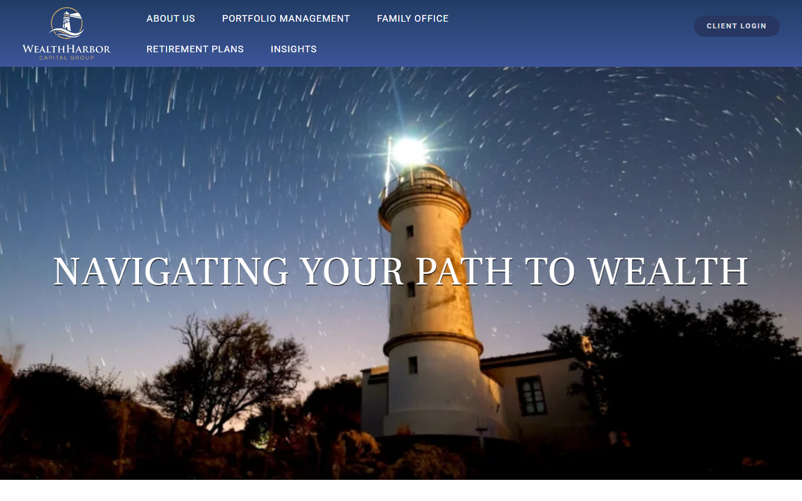

# WealthHarbor

Educational personal finance and investing platform

**Live:** [https://wealthharbor.com](https://wealthharbor.com)  
**Repository:** https://github.com/Ayushkumarsingh09/wealthharbor

Personal finance education covering investing, budgeting, taxes, and wealth-building with clear, practical guides.


## Screenshots

### Homepage



> Captured from the live project UI.

## Features

- Modern source structure under `src/` with typed modules
- Rich educational / editorial content collection
- Optimized public assets, branding, and social previews
- SEO foundations: metadata, sitemap/robots, and share cards
- Production-ready configuration for static or Node hosting
- Live deployment target: [wealthharbor.com](https://wealthharbor.com)

## Tech Stack

- Astro
- TypeScript
- Tailwind CSS

## Quick Start

```bash
# Install dependencies (if package.json is present)
npm install

# Start local development
npm run dev
```

> Some projects are PHP/WordPress packages — follow their deployment docs in `docs/` or `DEPLOY*.md` instead of `npm run dev`.

## Scripts

| Command | Description |
|---------|-------------|
| `npm run dev` | Local development server |
| `npm run build` | Production build |
| `npm run lint` | Lint source (when configured) |

## Project Structure

```text
.
├── src/ or app source        # Application code
├── public/ or assets/        # Static assets
├── docs/                     # Deployment & operations notes
├── scripts/                  # Maintenance / content generators
└── README.md                 # You are here
```

## Deployment

This project is prepared for production hosting (Hostinger / Vercel / static export / PHP hosting depending on stack).

1. Configure environment variables from `.env.example` (when present)
2. Build or upload according to the project stack
3. Point the domain to the hosting target
4. Verify the live URL: https://wealthharbor.com

## Author

**Ayush**  
GitHub: [Ayushkumarsingh09](https://github.com/Ayushkumarsingh09)

## License

All rights reserved © WealthHarbor. Source is published for portfolio and deployment use unless otherwise noted.
